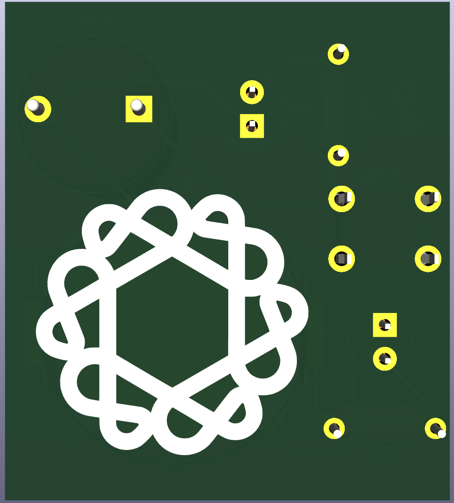

# Kivy Buzzer

This is a buzzer that I decided to name kivy because I think kiwi's make weird sounds and I will play with it with my friends

# Slack User
Project made by: cazacuchristian
aka. Karo

Materials:
 - PCB
 - Resistor
 - Button
 - Battery holder (+ battery if you want it to work)
 - Buzzer

## Schematic

## PCB

# 3D view

